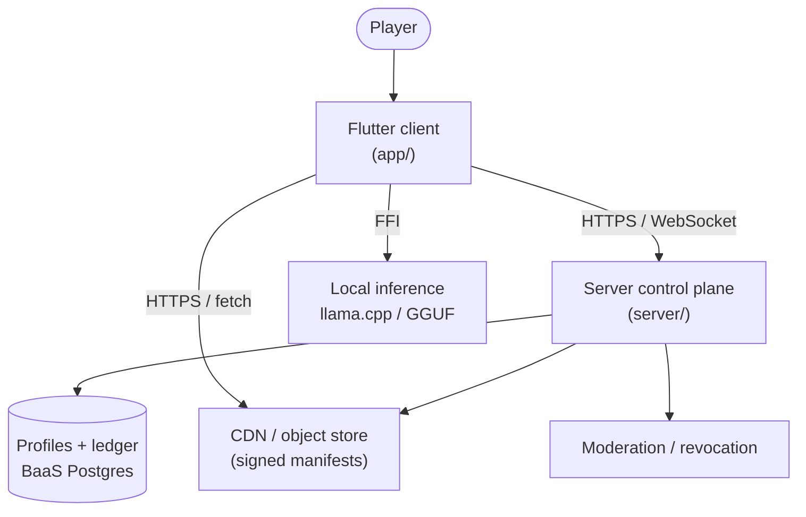

# 🏛 Architecture: Psychosims

> The repo-level architecture and — critically — the **module boundary map** and
> **configuration authority** that every phase of [`ROADMAP.md`](../planning/ROADMAP.md)
> must honour (Principles 1 and 2). Section refs (§N) point at
> [`STARTER.md`](../design/STARTER.md). This document is the "where does new code go?"
> contract.

## 1. System context

Psychosims is a server-client system. The Flutter client runs the game loop and
local AI inference; a small authoritative server owns everything trustworthy;
patient content is delivered from a CDN/object store.

- **Client-side (local):** session play, local inference, UI, provisional turn
  resolution. The client *proposes* outcomes; it never self-certifies them.
- **Server-side (authoritative):** identity, profiles/progression, matchmaking,
  ownership arbitration, receipt validation, content signing, economy ledger,
  moderation, macro-event seeding, creator-royalty accounting.

## 2. Top-level components (the module boundary map)

The monorepo is organized for **strong separation of concerns** (Principle 2).
Each domain lives in its own directory; shared logic lives in a common layer;
deterministic rules never mix with UI or I/O.

| Component | Path | Responsibility |
|---|---|---|
| Client app | `app/` | Flutter cross-platform client (the game loop + UI). |
| — Sim core | `packages/psycore/` | **Pure deterministic rules**: state, outcomes, prompt assembler. No I/O, no model calls. Imported by `app/lib/core/` and `tools/`. |
| — App adapter | `app/lib/core/` | Thin adapter that re-exports `packages/psycore/` for the Flutter app and wires DI. |
| — Features | `app/lib/features/` | One directory per domain: `session/`, `cards/`, `clinic/`, `progression/`, `recovery/`, `content/`, `presentation/`. |
| — Shared | `app/lib/shared/` | Reusable utilities, models, services (inference service, config access, networking, logging). |
| Server | `server/` | Authoritative control plane (auth, receipts, ownership, matchmaking, signing, moderation, royalties). Go. |
| Native / FFI | `native/` | C/C++ shim to llama.cpp and generated Dart FFI bindings. |
| Shared packages | `packages/` | Cross-cutting Dart packages reused by app + tools (`psychemas/`, `psycore/`). |
| Content pipeline | `content/` | Nine-axis manifest generation, validation gate, signing inputs. |
| Config authority | `config/` | **The single centralized configuration source** (schema, overlays, loader). See §4. |
| Tooling | `tools/` | Balance sandbox, bots, integration sandbox, diagnostics. |
| Docs | `docs/` | This documentation set + the roadmap + tracking. |

**The rule:** new code lands inside exactly one declared module. Domain logic →
`features/`; pure rules → `core/`; anything reused by two+ modules → `shared/`
or `packages/`. Nothing reads configuration except through `config/` (§4).

## 3. Data flow (happy path: one session turn)

1. Player selects a card in a `session/` feature screen.
2. `core/` (sim core) evaluates the action against deterministic rules, updates
   state, and produces approved narrative context + mandatory clue tokens (§4).
3. `core/` prompt assembler builds a token-budgeted, tiered prompt (§6).
4. `shared/` inference service runs the local model; a validation pass confirms
   clue tokens survived (templated fallback if not).
5. The UI renders the returned dialogue. The turn's structured delta is queued.
6. At session end, a structured **receipt** is submitted to `server/`, which
   validates it (plausibility bounds + anomaly detection + `ruleset_version`)
   and only then updates the authoritative profile (§3).

## 4. Cross-cutting concerns

- **Config (Principle 1 — the load-bearing one):** all configuration resolves
  through the `config/` authority — one typed schema, loaded once, validated at
  startup, environment differences expressed as validated overlays. No module
  reads raw environment variables or holds scattered constants; balance numbers,
  endpoints, model params, and feature flags all flow from here. Secrets are
  referenced by *variable name* only, never committed. See
  [`../design/DESIGN-centralized-configuration.md`](../design/DESIGN-centralized-configuration.md).
- **Auth:** server-authoritative identity for the life of the product; the client
  caches but never owns it (§3). Apple/Google on mobile; desktop channels decided
  in roadmap C-5.
- **Logging:** one cross-stack structured log-line schema, rendered identically
  by Dart, the C++ FFI shim, and the Go server. See
  [LOGGING.md](LOGGING.md). Direct `print`/`std::cout`/`stdout` writes fail CI.
- **Errors:** classify user / system / external; offline is a first-class state
  (durable receipt queue, idempotency keys) not an error. See
  [ERROR_TAXONOMY.md](ERROR_TAXONOMY.md) (§3).
- **Versioning & identifiers:** `ruleset_version` and `manifest_schema_version`
  live in one registry ([VERSIONING.md](VERSIONING.md));
  canonical serialization and wire-compatibility rules live in
  [SERIALIZATION.md](SERIALIZATION.md) and [SHARED_SCHEMAS.md](SHARED_SCHEMAS.md);
  identifier and idempotency-key strategy lives in [IDENTIFIERS.md](IDENTIFIERS.md)
  (§3).
- **Trust boundary:** "a client-computed number is a claim, not a fact." High-value
  economy outputs require bounded server derivation (§3). Exact operator-pinned
  Dart witnesses certify an initial finite set of cure paths; other schema 0.3
  receipts remain `held_unproven`. A device signature cannot prove terminal
  gameplay. See [ADR-0009](../design/ADR-0009-bounded-authoritative-derivation.md), [SECURITY.md](../../SECURITY.md) and
  [data classification](../project/DATA-LIFECYCLE.md) for current controls and
  acceptance limits.

## 5. Invariants you must not break

- **The sim core is pure.** `app/lib/core/` has no I/O and no model calls; outcomes
  are deterministic given state + action (§4).
- **The model never decides outcomes.** It voices dialogue only; clue emission is
  owned by the core (§4).
- **Only server-accepted results mutate the authoritative profile** (§3).
- **No transcripts anywhere durable.** Manifests + receipts carry structured
  state/deltas only; dialogue is ephemeral (§5, §17).
- **`memory_class` discipline:** stateless patients carry no history envelope (§12, §17).
- **All configuration flows through `config/`.** A module reading `env` directly
  is a defect (Principle 1).
- **All constants are owned by the balance spec**, loaded via `config/`, never
  hard-coded in features (§9).

## 6. Deployment topology

- **Dev:** Flutter runs on Linux desktop + x86 Android emulator (build/packaging
  baseline); server + BaaS run locally; the `tools/` sandboxes run headless.
- **Staging/prod:** managed BaaS (Postgres + auth) for profiles/ledger; CDN/object
  store for signed manifests; the server control plane as a real, cost-modelled
  service (§3) — not a free static host.

## 7. Out of scope

- **Not a backend rules engine.** The server validates receipts; it does not
  re-implement or re-derive the game rules (§3).
- **Not a chat platform.** No free-form player messaging (§1).
- **Not a real clinical tool.** Fictional simulation only (§8).
- **Not an MLOps retrain pipeline.** The shipped model footprint is fixed (§5, §18).
