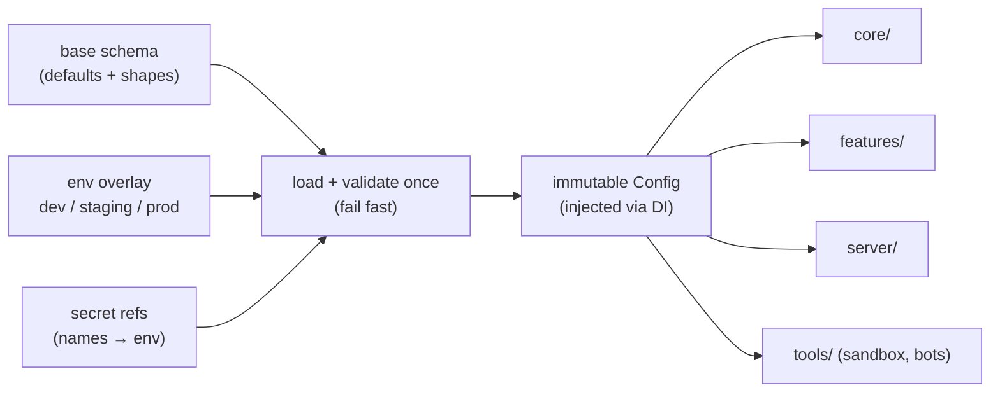

# 🎨 Design: Centralized configuration authority

> The concrete design behind Principle 1 of [`ROADMAP.md`](../planning/ROADMAP.md).
> Built in Phase 0.2. Section refs (§N) point at [`STARTER.md`](STARTER.md).

- **Status**: accepted
- **Author**: @maintainer
- **Date**: 2026-07-11
- **Supersedes**: none

## Problem

A system this size (Flutter client, server control plane, content pipeline,
sandboxes) has many settings: API endpoints, model parameters, token budgets,
feature flags, and every balance constant (§9). If those scatter across modules,
per-environment files, and hard-coded literals, they drift, contradict each
other, and become impossible to reason about — the exact maintainability trap
this project is designed to avoid.

## Goals

- **One authoritative source** for all shared configuration (`config/`).
- **Typed + validated** at startup; invalid config fails fast with a clear message.
- **Environment differences as validated overlays** on one base schema — not
  scattered per-environment files.
- **Injected, not imported ad-hoc**: modules receive config via DI; none reads raw
  environment variables.
- **Balance constants flow through config**, owned by the balance spec (§9).
- **Secrets by reference only** — variable *names* in the repo, never values.

## Non-goals

- Not a remote/dynamic config service (feature-flag SaaS) — that can be added later
  behind the same interface without changing call sites.
- Not per-user settings/preferences (that is client UI state, a separate concern).

## Proposed design

A single `config/` layer defines one typed schema. A loader composes the effective
config from: (1) the base schema defaults, (2) the active environment overlay, and
(3) referenced secrets pulled from the environment by name. It validates the result
once at startup and exposes it as an immutable, injected object.

- **Schema:** a typed model (grouped: `network`, `model`, `promptBudget`,
  `balance`, `featureFlags`, `secretsRefs`). Every field has a type + validation.
- **Loader:** pure where possible; composes base → overlay → secret refs, then
  validates. Rejects unknown keys and out-of-range values.
- **Access:** DI provides the immutable `Config` to every module. No module imports
  `Platform.environment` (or equivalent) directly.
- **Balance constants:** live in the `balance` group, sourced from the balance spec
  (§9) and consumed by the sandbox (§3) and the sim core — never duplicated in features.

## Alternatives considered

- **Per-module config + `.env` files.** Rejected: the scatter this design exists to
  prevent; no single place to validate or reason about the whole surface.
- **Hard-coded constants with a "TODO: extract later".** Rejected: constants become
  load-bearing before they are extracted; §9's placeholder discipline requires a
  single owner from day one.
- **Remote config service first.** Rejected as premature; the DI interface keeps it a
  drop-in later.

## Migration / rollout

Greenfield — built in Phase 0.2 before any feature reads config, so there is no
retrofit. Every subsequent phase consumes `Config` via DI from the start.

## Risks

- **Schema sprawl** as systems grow → mitigate by grouping and keeping the balance
  spec as the single owner of constants.
- **A module bypassing the authority** (reading env directly) → caught in review as
  an invariant violation ([`../code/ARCHITECTURE.md`](../code/ARCHITECTURE.md) §5);
  consider a lint rule.

## Enforcement

- Raw environment reads outside `config/` are rejected by `scripts/env_read_check.sh`,
  which runs as part of `make lint` and CI.
- Every balance constant is bound to the `balance` group in `Config`, sourced from
  the [C-4 balance spec](../specs/BALANCE-SPEC.md).

## Open questions

- Whether server + client share one schema package or two aligned ones under
  `packages/` — decided when the server language/runtime is finalized (Phase 3).
  (Resolved: Go server mirrors Dart schemas via shared JSON payloads validated by golden fixtures.)
