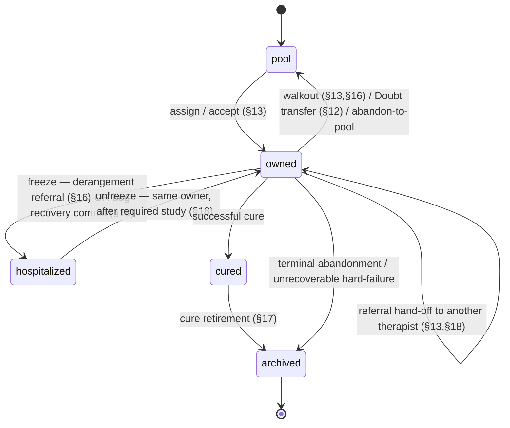

# 🔄 C-8 — Patient lifecycle state machine

> **Closes register item C-8** ([ROADMAP](../planning/ROADMAP.md#-conceptual-corrections-register)).
> The authoritative state machine (the corrected §18, resolving audit finding GM-1),
> so Phase 3.6 encodes it exactly rather than re-deriving it. Every transition is
> **server-arbitrated**; the client only proposes. Section refs (§N) → [`STARTER.md`](../../STARTER.md).

- **Status:** spec complete (implemented in Phase 3.6)
- **Owner:** @maintainer
- **Consumed by:** Phase 3.6 (ownership arbitration), Phase 5.4 (referral/hospital), Phase 4.5 (routing)

## States

| State | Meaning |
|---|---|
| `pool` | Active but unowned; awaiting assignment. |
| `owned` | Assigned to exactly one therapist. |
| `hospitalized` | Frozen under the **same** owner; temporary (asylum). |
| `cured` | Successfully treated (transient → `archived`). |
| `archived` | Out of the live pool: in the completing therapist's record or the asylum registry. |

## Transition diagram

## Legal transitions (the contract)

| From → To | Trigger | Guard (server-enforced) |
|---|---|---|
| `pool → owned` | assignment / acceptance (incl. reassignment of a re-pooled case) | routing eligibility (§4.5); single-owner lock acquired. |
| `owned → pool` | walkout, Doubt-driven transfer, or abandon-to-pool | server executes the Doubt roll (§12); ownership lock released. |
| `owned → owned′` | server-mediated referral | receiver is a free, compatible, similar-tier therapist; hand-off carries the §17 envelope + deltas only (no transcripts). |
| `owned ⇄ hospitalized` | freeze then later unfreeze, **same owner** | freeze trigger recorded (derangement vs bug-recovery); unfreeze requires the owner to finish the gating study. |
| `owned → cured → archived` | successful cure | cure computed/accepted server-side (§3); case retired to the therapist's record. |
| `owned → archived` | terminal abandonment / unrecoverable hard-failure | distinct from abandon-to-pool; case leaves the live pool. |

**Illegal by construction:** `hospitalized → archived` directly (asylum is temporary,
not terminal — the GM-1 bug); any client-initiated ownership change without a
server round-trip; two simultaneous `owned` holders (single-owner lock).

## Invariants

- **Server is the single source of truth for ownership** (§12); the client proposes.
- **Single-owner exclusivity** is a locking guarantee (the double-assignment analog
  of double-spend) — enforced by the authoritative owner record.
- **"Nothing is deleted" = every case is accounted for**, not "every case stays in
  the live pool forever." `archived` lives outside the live pool.
- **Freeze trigger is recorded** (in-fiction derangement vs out-of-fiction
  bug-recovery) so analytics never conflate gameplay outcomes with defect reports (§18).
- **`memory_class: stateless`** (social-chronic) patients never accumulate a signed
  history envelope and follow the same states minus persistent memory (§17).

## Test obligations (Phase 3.6)

- Every legal transition above has a passing test.
- Every illegal transition is rejected (esp. `hospitalized → archived`, double-owner,
  client-initiated transfer).
- Re-pool on walkout/transfer, referral hand-off, and temporary hospitalization →
  return-to-same-owner are explicitly covered (the transitions GM-1 originally forbade).

## Open

- Exact hard-failure threshold that routes `owned → archived` vs `owned → pool`
  (a placeholder owned by [C-4](BALANCE-SPEC.md)).
